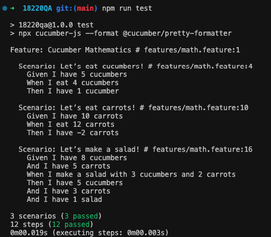
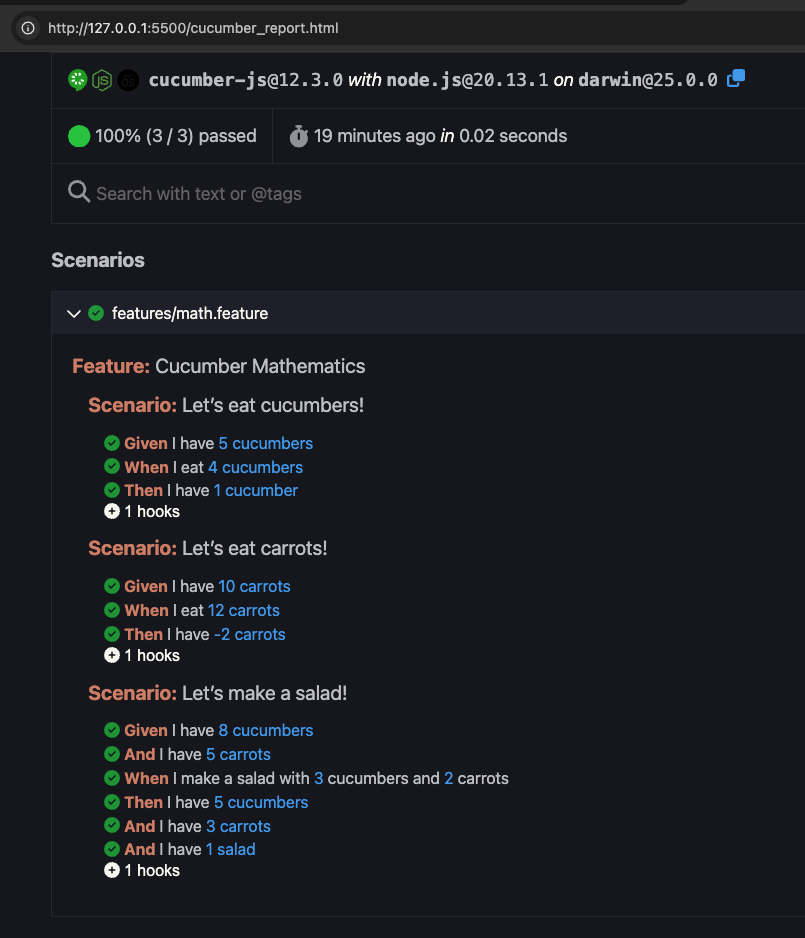

# Cucumber Mathematics BDD
Automation project using Node.js and Cucumber.js.

## Prerequisites
Node.js (Version 14 or higher recommended), I used 20.

## Clone Repository
```bash
git clone https://github.com/pramoso51/18220QA.git
```

## Installation
1. Install dependencies, in the bash terminal execute: 
```bash
npm install
```

## Execution
2. In the bash terminal execute: npm test
3. If you want to chech the html report execute: 
```bash
npm run test:report
```

## Documentation / Reports / Evidence
Below are the visual results of the test execution.

### Terminal Output
The following screenshot shows the successful execution of all scenarios using the integrated console formatter.


### HTML Visual Report
This is the interactive report generated automatically, providing a high-level overview of the test results.
